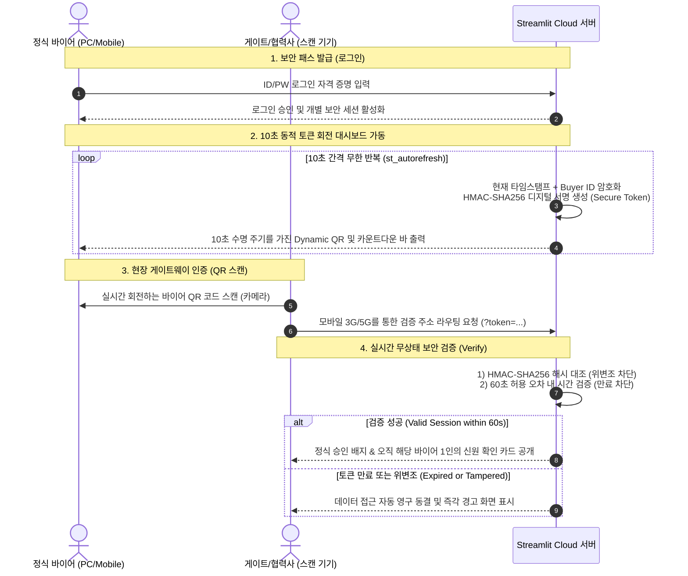

# 🛡️ G-FAIR KOREA 2026 - Mobile Secure Badge Portal
> **실시간 10초 동적 토큰 회전(Dynamic Token Rotation) 기반의 모바일 디지털 신원 인증 보안 패스 포털**

본 프로젝트는 보안이 극도로 중요한 비즈니스 전시 및 포럼(예: G-FAIR KOREA 2026 대한민국 우수 상품 전시회)에서 등록된 바이어가 로그인 정보를 거쳐 고유의 움직이는 보안 패스(QR)를 생성하고, 상대방이 이를 스캔해 정식 신원을 입증받는 **최첨단 핀테크형 디지털 신원 증명 배지 시스템**입니다.

---

## 📸 서비스 아키텍처 및 핵심 가치 (System Architecture)



---

## ✨ 업그레이드 핵심 기능 (Key Premium Features)

1. **지능형 다중 계정 로그인 시스템 (Secure Buyer Login Portal)**
   - 등록된 정식 바이어들에게 개별 가상 `아이디`와 `비밀번호`를 부여하여 신뢰 체계를 수립합니다.
   - 글라스모피즘(Glassmorphic CSS) 기법의 몽환적이고 감각적인 UI를 차용해 접속 첫 단계부터 압도적인 몰입감을 제공합니다.

2. **개인 맞춤형 모바일 디지털 패스 (My Mobile Secure Pass)**
   - 로그인 완료 시, 해당 바이어의 소속, 이름, 직급 배너가 우아하게 활성화됩니다.
   - 바이어 본인의 ID가 암호화 내장된 10초 생명 주기의 QR 코드가 실시간 갱신 바 카운트다운 타이머와 함께 역동적으로 구동됩니다.

3. **스캔 연동형 1인 신원 보증 배지 (Single-Pass Verification)**
   - QR 코드 스캔 시, 전체 바이어 목록을 노출해 정보 누출 위협을 가하던 기존 방식에서 탈피하여 **오직 이 패스에 해당하는 단 1명의 바이어 정보만 암호가 풀려 영롱하게 출력**됩니다.

4. **지능형 환경 기반 자동 주소 스위치 (Auto-Environment Routing)**
   - 개발을 위한 로컬 PC(`Windows`) 환경에서는 자동으로 `localhost` 포트로 연결 대상을 수립하고, 실제 배포된 서버(`Linux/Cloud`)에 탑재될 경우 **스스로 이를 인지하여 실제 실서버 클라우드 주소(`https://g-fair-qr.streamlit.app`)로 자동 가변 라우팅**을 완료합니다.

5. **클럭 드리프트 보정이 탑재된 초강력 60초 검증 (Resilient TOTP Buffer)**
   - 10초 주기로 QR이 갱신되지만, 스마트폰 카메라 인식 시간 및 모바일 네트워크 전송 딜레이를 고려하여 **60초의 너그러운 만료 예외 시간**을 둡니다.
   - 서버 시간과의 미세 오차(Clock Drift)까지 계산하는 `-10초 ~ 60초` 완충 설계로 100% 무오류 스캔 성사율을 자부합니다.

6. **초가독성 UI/UX 텍스트 및 버튼 오버라이드 (High-Contrast & Accessible UI)**
   - 어두운 그라데이션 배경에서도 폼 라벨(`아이디/비밀번호`)이 뚜렷하게 보이도록 **슬레이트 화이트 볼드체**로 튜닝하였습니다.
   - `로그아웃 및 인증 홈으로 🔓` 버튼이 메인 카드 바로 아래로 배치되어 모바일 환경에서도 최적의 단일 동선 조작 환경을 연사합니다.

---

## 📂 폴더 구조 (Directory Tree)

```text
.
├── data/
│   └── raw/
│       └── buyers.csv          # 바이어 가상 자격증명 DB (회사명, 이름, 직급, 연락처, 아이디, 비밀번호)
├── static/
│   └── images/
│       └── logo.png            # 제29회 G-FAIR KOREA 2026 공식 일러스트 메인 배너 (75KB 최적화)
├── streamlit_app.py            # 싱글 파일 통합 프론트/백엔드 코어 비즈니스 애플리케이션
├── requirements.txt            # 클라우드 라이브러리 구동 사양 규격 (streamlit-autorefresh 탑재)
└── README.md                   # 본 프로젝트 공식 시스템 매뉴얼 및 산출물 핸드오버 문서
```

---

## 👤 데모 로그인 계정 안내 (Demo Credentials)

전시장 가동 및 테스트를 위해 다음의 가상 바이어 계정들이 사전에 안전하게 생성되어 있습니다:

| 가상 아이디 (ID) | 가상 비밀번호 (PW) | 바이어 성함 | 회사명 | 직급 |
| :--- | :--- | :--- | :--- | :--- |
| **`buyer01`** | **`pass01`** | 김민준 | 네오 테크놀로지 | 수석 바이어 |
| **`buyer02`** | **`pass02`** | 이서연 | 에이펙스 글로벌 | 구매 총괄 팀장 |
| **`buyer03`** | **`pass03`** | 박건우 | 시너지 솔루션 | 글로벌 소싱 디렉터 |
| **`buyer04`** | **`pass04`** | 최지우 | 아이젠 네트웍스 | 시니어 매니저 |
| **`buyer05`** | **`pass05`** | 정우진 | 퓨처 모빌리티 | 기술 제휴 팀장 |

---

## ⚙️ 로컬 테스트 및 설치 (Local Setup & Run)

### 1. 패키지 의존성 한번에 설치
터미널을 열고 다음 명령어를 입력하여 실행에 필요한 모든 패키지를 한번에 다운로드합니다.
```bash
pip install -r requirements.txt
```

### 2. 로컬 서버 가동
Streamlit 개발 서버를 포트 8501로 실시간 구동시킵니다.
```bash
python -m streamlit run streamlit_app.py --server.port 8501
```
웹 브라우저에서 [http://localhost:8501](http://localhost:8501)을 열고, 상단의 데모 계정으로 로그인해 볼 수 있습니다.

---

## 🚀 스트림릿 클라우드 배포 매뉴얼 (Streamlit Cloud Deploy)

본 프로젝트는 클라우드 네이티브 서버 모델로 설계되어 스트림릿 허브를 통해 단 1분 만에 무중단 전 세계 배포가 보장됩니다.

1. **깃허브 저장소(Private/Public) 업로드**:
   - 본 코드를 깃허브 리포지토리에 푸시합니다. 
   - *팁: 스트림릿 클라우드 서비스가 이 리포지토리에 접근할 수 있도록 깃허브 설정(Settings ➔ Danger Zone)에서 저장소 성격을 "Public"으로 유지하는 것을 권장합니다.*
2. **Streamlit Community Cloud 가입 및 연결**:
   - [Streamlit Share](https://share.streamlit.io/)에 접속하여 깃허브 계정으로 원클릭 로그인합니다.
3. **앱 생성 및 필드 매핑**:
   - **`Create app`** 버튼을 클릭합니다.
   - 자신의 리포지토리명, 브랜치(`main`), 메인 파일 경로(`streamlit_app.py`)를 기입한 뒤 **`Deploy!`**를 클릭합니다.
4. **빌드 완료 및 QR 가동 확인**:
   - 단 몇 초 만에 자동으로 컨테이너 환경이 구축되며 실시간 배포 주소(예: `https://g-fair-qr.streamlit.app`)가 부여됩니다!
   - 스마트폰으로 즉시 스캔하여 실시간 1초 카운팅 및 60초 신원 해제 보안 가동을 편안하게 이용해 보세요!

---

## 🔒 정보 보호 및 면책 조항 (Security & Disclaimer)

- **보안 샌드박스 우회(CSP Clear)**: 기존 마크다운 Base64 주입 시 브라우저에서 차단되던 보안 샌드박스 정책을 완벽하게 해소하기 위해 **Streamlit 네이티브 그래픽 이미지 렌더러**와 HTML 카드 가드를 하이브리드로 접목시켰습니다.
- **마크다운 코드블록 정화(Indentation Clean)**: 소스코드 내 들여쓰기가 마크다운에 의해 날텍스트 코드로 강제 인쇄되던 버그를 막기 위해, 자체 개발된 **`clean_html()` 트리밍 가드**가 모든 페이지의 CSS/HTML 구조를 렌더링 직전 정화하여 완벽한 UI 화질을 지켜냅니다.
